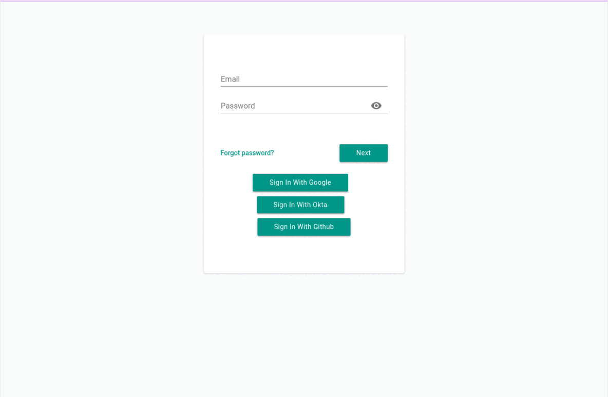

# Paralus

Paralus is a free, open source tool that enables controlled, audited access for developers & SREs to your Kubernetes infrastructure. It comes with just-in-time service account creation and user-level credentials management that integrates with your RBAC/SSO solution.

It eliminates the burden of having to configure and manage Kubernetes Role Based Access Control cluster by cluster. Streamline and consolidate access control for your fleet of clusters spanning different operating environments, different clouds (EKS, AKS, etc.), and on-premises data centers operating behind firewalls. A single login gives authorized users (e.g., developers, operations, contractors, etc.) seamless and secure access to all clusters with a native and familiar kubectl experience.

 

## Getting Started

Our engineers have put together a set of documents to help you get started quickly:

- [Quickstart Guide](https://www.paralus.io/docs/quickstart/)
- [Installation](https://www.paralus.io/docs/installation)

## Features

- Zero Trust Kubernetes with zero friction
- Manage access to all your clusters from one centralized, free, platform
  - Keep your existing SSO or RBAC solution
  - Create permissions with sensible defaults and powerful customization
  - Manage resources from cluster-level to user-level
- Zero-trust security by default
  - Keep your existing kubectl scripts and workflows
  - Control access with pre-configured roles
  - Dynamically change permissions and their duration
- Batteries-included auditing tools
  - Quickly answer queries about who accessed what
  - View cluster-level history
  - Leverage Kubernetes-aware filtering by cluster, namespace, access method, etc.
- Access through the web or CLI
  - pctl tool to manage kubeconfigs directly from terminal
  - Well-documented REST API
  - A modern web interface

## Community & Support

- Visit [Paralus website](https://paralus.io) for the complete documentation and helpful links.
- Join our [Slack channel](https://join.slack.com/t/paralus/shared_invite/zt-1a9x6y729-ySmAq~I3tjclEG7nDoXB0A) to post your queries and discuss features.
- Tweet to [@paralus_](https://twitter.com/paralus_/) on Twitter.
- Create [GitHub Issues](https://github.com/paralus/paralus/issues) to report bugs or request features.

## Contributing

The easiest way to start is to look at existing issues and see if there’s something there that you’d like to work on. You can filter issues with the label “Good first issue” which are relatively self sufficient issues and great for first time contributors.

Once you decide on an issue, please comment on it so that all of us know that you’re on it.

If you’re looking to add a new feature, raise a [new issue](https://github.com/paralus/paralus/issues) and start a discussion with the community. Engage with the maintainers of the project and work your way through.
