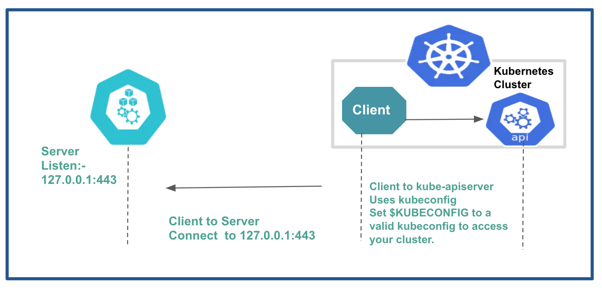

# rafay-relay unit testing
k8s api server relay unit testing


## Environment
Please refer below image to setup your test environtment. You can run server and client in the same system.




## Testing
Add entries in /etc/host or in your DNS-server for  the relay-server ipaddress.\
The User facing DNS is **cluster1.kubectl.relay.rafay.dev**\
The Dialin facing DNS is **cluster1.kubectldialin.relay.rafay.dev**\
For example; to run client and server in local system, the /etc/host will have entries like below.
```
127.0.0.1   cluster1.kubectl.relay.rafay.dev
127.0.0.1   cluster1.kubectldialin.relay.rafay.dev
```

### Client System setup
Makesure $KUBECONFIG environment variable is set in the client system\
(OR)
You can use testdata/kubectlconfigs/kubeconfig and customise it for your setup.
```
export KUBECONFIG=testdata/kubectlconfigs/kubeconfig
```

### Cluster serviceaccount setup
Apply config pkg/proxy/testdata/role.yaml
```
kubectl apply -f pkg/proxy/testdata/role.yaml
```

Run service using below commands
```
sudo relay.exe -config ./testdata/server.yaml start server
```
### Relay client for cluster1
```
relay.exe -config ./testdata/client-cluster1.yaml start client

``` 
### Relay client for cluster2
```
relay.exe -config ./testdata/client-cluster2.yaml start client

``` 

### Using Relay for kubectl
In kubeconfig set server address to relay.\
Relay uses MTLS to authenticate. Set `client-certificate` and `client-key` to cert signed by the relay service rootCA. For kubectl to validate the relay server set `certificate-authority`. Use `--insecure-skip-tls-verify` to skip the server validation.

Examples:
```
kubectl --kubeconfig testdata/kubectlconfigs/kubeconfigproxy-cluster1 get pods
kubectl --kubeconfig testdata/kubectlconfigs/kubeconfigproxy-cluster2 get pods
kubectl --kubeconfig testdata/kubectlconfigs/kubeconfigproxy-cluster1 exec -it demo-sa1 -- /bin/sh
kubectl --kubeconfig testdata/kubectlconfigs/kubeconfigproxy-cluster2 exec -it demo-sa1 -- /bin/sh
```

### Production
Relay server need following environment variables

POD_NAME - name of the relay instaance (auto generated)
POD_NAMESPACE - namespace of the relay instance

RAFAY_SENTRY -  URL to boostrap with sentry service
RAFAY_RELAY_PEERSERVICE - To join gRPC with sentry peer service


RELAY_USER_DOMAIN - domain suffix for relay user facing server 
RELAY_CONNECTOR_DOMAIN - domain suffix for relay connector facing domain

RELAY_TOKEN - Peer Service Token bootstrapping
RELAY_USER_TOKEN - Relay user facing server bootstrapping
RELAY_CONNECTOR_TOKEN - Relay connector facing server bootstrapping

Examples:
```
export RAFAY_SENTRY=http://sentry.rafay.dev:9000
export RAFAY_RELAY_PEERSERVICE=http://peering.sentry.rafay.local:7001

export RELAY_USER_DOMAIN="user.relay.rafay.local"
export RELAY_CONNECTOR_DOMAIN="core-connector.relay.rafay.local"

export RELAY_TOKEN=bqfvhabipt3a2g46986g
export RELAY_USER_TOKEN=bqfvhabipt3a2g46987g
export RELAY_CONNECTOR_TOKEN=bqfvhabipt3a2g469870
