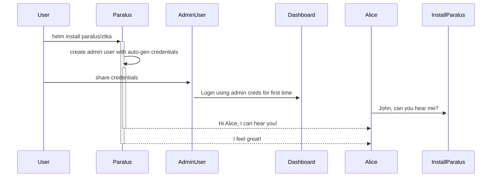
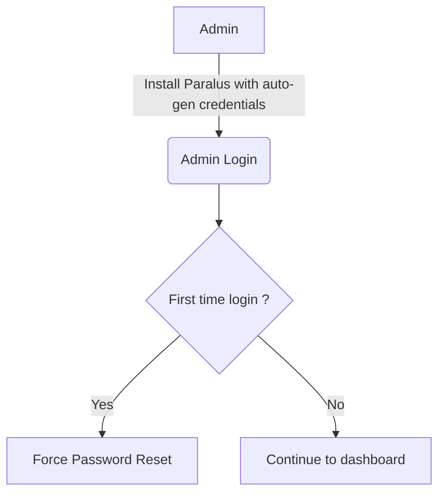
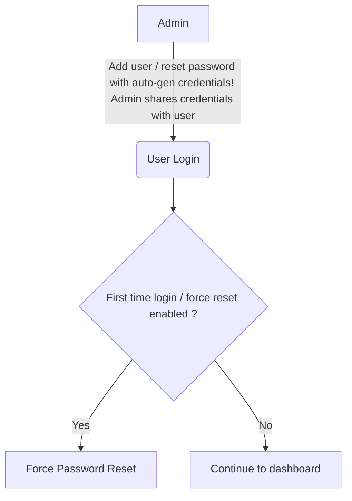

``` mermaid
sequenceDiagram
    User->>+Paralus: helm install paralus/ztka
    Paralus->>+Paralus: create admin user with auto-gen credentials 
    User->>+AdminUser: share credentials
    AdminUser->>+Dashboard: Login using admin creds for first time
    Alice->>+InstallParalus: John, can you hear me?
    Paralus-->>-Alice: Hi Alice, I can hear you!
    Paralus-->>-Alice: I feel great!
```

```mermaid
graph TD
    A[Admin] -->|Install Paralus with auto-gen credentials| B(Admin Login)
    B --> C{First time login ?}
    C -->|Yes| D[Force Password Reset]
    C -->|No| E[Continue to dashboard]
```

```mermaid
graph TD
    A[Admin] -->|Add user / reset password with auto-gen credentials! Admin shares credentials with user| B(User Login)
    B --> C{First time login / force reset enabled ?}
    C -->|Yes| D[Force Password Reset]
    C -->|No| E[Continue to dashboard]
```